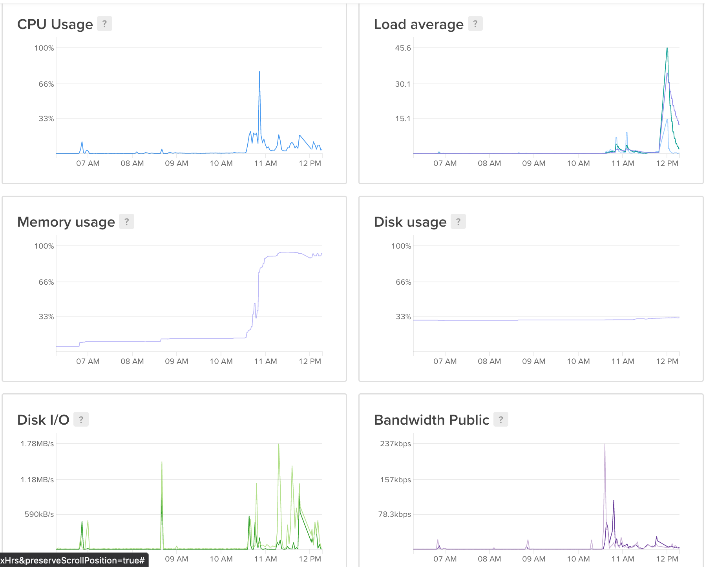

# Microbiome notes
Here are some technical notes regarding virtual machines used for [the microbiota data analysis lesson](https://scienceparkstudygroup.github.io/microbiome-lesson/). 

# Configurations

## Virtual Machine config 1

Episodes alpha-diversity was performed with 21 students on this machine: 

21 students with a virtual machine with:
- 16 GB Memory
- 6 vCPUs 
- 25 GB Disk 
- Docker 5:19.03.1 on Ubuntu 18.04

This configuration is not enough (check the memory usage below):

## Virtual Machine config 2

The machine config was upgraded to this one:  
- 16 vCPUs 
- 64 GB Memory
- 25 GB disk
- Docker 5:19.03.1 on Ubuntu 18.04

# Tips

## To create N containers
See the `create-virtual-machines-microbiome.sh` script for this.